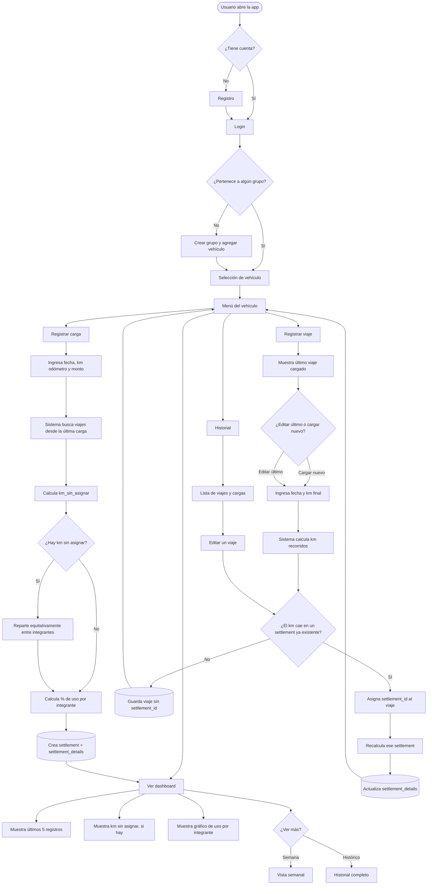

# KmSplit 🚗⛽
🔗 **[Ver la app en vivo](https://kmsplit.vercel.app/login)**
> Reparto justo del gasto de combustible en autos compartidos, proporcional a los km recorridos por cada persona.

**Versión actual:** [`v1.0.0`](https://github.com/mariano-casarino/KmSplit/releases) ·
[CHANGELOG](CHANGELOG.md) · [Guía de desarrollo](DEVELOPMENT.md)

## Descripción

KmSplit es una aplicación web mobile-first que resuelve un problema muy común en familias o grupos que comparten un mismo auto: **repartir el gasto de combustible de forma justa**, según cuánto manejó realmente cada persona, y no de forma equitativa a ciegas.

La app permite registrar los viajes diarios de cada conductor y las cargas de combustible, calculando automáticamente cuánto le corresponde pagar a cada integrante del grupo en base a los kilómetros recorridos entre carga y carga.

Aunque el diseño es mobile-first, **la app se ve bien en cualquier pantalla**: en tablet y escritorio la interfaz se mantiene en una columna centrada, con más aire y foco visible para navegar con teclado.

## Problema que resuelve

Cuando varias personas comparten un vehículo (por ejemplo, en una familia), es común que el gasto de combustible se divida en partes iguales sin importar quién usó más el auto. Esto genera injusticias y discusiones. Llevar este control a mano en una planilla de cálculo funciona, pero es incómodo, propenso a errores y difícil de mantener actualizado desde el celular.

KmSplit digitaliza y automatiza ese proceso, ofreciendo:

- Registro rápido de viajes desde el celular (mobile-first)
- Cálculo automático y transparente del reparto proporcional
- Historial y visualización clara del gasto de cada integrante
- Detección de kilómetros no asignados (viajes no registrados) para mantener la trazabilidad

## Funcionalidades del MVP

- [x] Registro y login de usuarios
- [x] Creación de grupos (familia/convivientes) y vehículo asociado
- [x] Carga de viajes diarios (usuario, km inicial, km final)
- [x] Carga de combustible (fecha, km del odómetro, monto total)
- [x] Cálculo automático de liquidación/reparto entre cargas
- [x] Dashboard con historial y gráficos de gasto por persona
- [x] Diseño responsive, mobile-first

## Funcionalidades agregadas después del MVP

- [x] **Login con Google** (verificación de `id_token` en el backend, vinculación por email y foto sincronizada)
- [x] **Notificaciones dentro de la app**: campana con badge, panel, vista paginada y "abrir/resaltar el registro" que originó el aviso
- [x] **Perfil** editable con cambio de contraseña, avatar y cierre de sesión
- [x] **Recuperación de contraseña** con código por email
- [x] **Roles por grupo** (propietario / administrador / integrante) con permisos de edición
- [x] **Fotos**: avatar de perfil, foto del grupo y foto del vehículo
- [x] **Detalle de liquidación** con el reparto por integrante, marcado de pagado y eliminación
- [x] **Resumen e historial** navegables con el mismo formato, historial por km y "km sin registrar"
- [x] **Respaldo automático a Google Sheets** vía Apps Script
- [x] **PWA instalable** (agregar a la pantalla de inicio)
- [x] **Responsive**: la app se ve bien en tablet y pc, no solo en celular

## Stack tecnológico

**Backend:** Python 3.12, Django 5.2 (LTS), Django REST Framework, Gunicorn (3 workers)  
**Base de datos:** PostgreSQL 16  
**Cache y throttling:** Redis 7  
**Frontend:** Angular 21, SCSS con variables CSS, Vitest para los tests  
**Autenticación:** JWT en cookies httpOnly + Google OAuth (`id_token` verificado en el backend)  
**Emails:** Brevo (API HTTPS) para la recuperación de contraseña  
**Integraciones:** Google Sheets (Apps Script) para el respaldo de viajes y cargas  
**Diseño:** Figma  
**Infraestructura:** Docker + Docker Compose (PostgreSQL, Redis, backend, frontend)

### Deploy

- **Frontend:** Vercel
- **Backend:** Railway (PostgreSQL y Redis administrados)
- Automatización por **integración con GitHub**: cada push a `main` dispara el
  deploy de ambos. Las migraciones se aplican solas al arrancar el backend.
- **No hay CI**: las suites de tests (148 de backend, 85 de frontend) se corren a
  mano antes de mergear a `main`.

Para levantar el proyecto y correr los tests: [DEVELOPMENT.md](DEVELOPMENT.md).
Para el historial de versiones: [CHANGELOG.md](CHANGELOG.md).

## 📂 Estructura del proyecto  

```text
KmSplit/
├── backend/                  # API Django REST Framework
│   ├── accounts/             # Autenticación y usuarios
│   ├── core/                 # Lógica principal de la aplicación
│   ├── config/               # Configuración de Django
│   ├── manage.py
│   └── requirements.txt
│
├── frontend/                 # Aplicación Angular
│   ├── src/
│   │   └── app/
│   │       ├── core/         # Guards, interceptores, modelos y servicios
│   │       ├── features/    # Funcionalidades principales
│   │       └── shared/      # Componentes reutilizables
│   ├── angular.json
│   └── package.json
│
├── docs/schema.dbml          # Esquema relacional (espejo de los models)
├── docker-compose.yml        # Orquestación de los servicios
├── CHANGELOG.md              # Historial de versiones
├── DEVELOPMENT.md            # Guía para levantar el proyecto y correr los tests
└── README.md                 # Documentación del proyecto
```
## 📸 Capturas / Demo

> Se agregaron capturas de pantalla de todo el avance del proyecto, como los diagramas de flujo, capturas de los wireframes y el modelo relacional de la base de datos en la primera estapa de proyecto.        
>

### 🔄 Diagrama de Flujo

Se documentó el flujo completo de la aplicación, desde el onboarding del usuario hasta la lógica de liquidación automática, incluyendo el circuito de edición de viajes cargados tarde y su impacto en el recálculo del reparto.

💡 **¿Por qué es importante este flujo?**

El punto más delicado del sistema es la liquidación: si un viaje se carga después de que ya se generó el reparto de una carga de combustible, el sistema lo detecta, lo asocia al período correspondiente y **recalcula automáticamente** cuánto le toca pagar a cada integrante — sin intervención manual.




> 
> 🎨 **Paleta de colores**       
Gama de azules y grises pensada para transmitir claridad y confianza, con acentos puntuales (ámbar para alertas, verde para confirmaciones) que ayudan al usuario a identificar rápido el estado de sus registros.
> 
Ver paleta completa:     
>         
[Link al Figma](https://www.figma.com/design/laSA5OAyx2tbP8l0ezerSE/KmSplit?node-id=0-1&t=eRqsWqXdQEigd7KL-1)    

📱 **Wireframes (Mobile-First)**    
Antes de escribir código se diseñaron los wireframes de baja fidelidad de las 9 pantallas del MVP, priorizando un flujo mobile-first ya que la carga de datos (viajes y combustible) se hace principalmente desde el celular, al lado del auto.    
    
Ver wireframes: 
> 
> Login, Registro y Recuperar contraseña    
> 
>     

> Seleccion de vehículo, Menú del vehículo y Registrar viaje    
> 
>       

> Registro de carga, Resumen y Historial semanal    
> 
>     

📂 Estructura de la Base de Datos      
Para este proyecto se diseñó el Modelo Relacional utilizando dbdiagram.io, una potente herramienta basada en DBML (Database Markup Language). Este enfoque de "arquitectura como código" permite mantener la documentación visual perfectamente sincronizada con la estructura lógica del sistema.

💡 ¿Por qué se incluye este modelo y para qué sirve?
- Claridad del Dominio: Permite entender de un vistazo cómo interactúan las entidades críticas del sistema (como users, vehicles, groups y trips).
- Integridad de Datos: Documenta de forma explícita las relaciones de la base de datos, definiendo las claves primarias (pk) y foráneas (fk) que aseguran la consistencia de la información.
- Mantenibilidad Extensible: Al estar escrito en código DBML, cualquier cambio futuro en el modelo se puede versionar en Git de la misma manera que el código fuente de la aplicación.
- Agilidad en el Desarrollo: Sirve como una guía visual directa para escribir las migraciones, modelos o consultas en el backend sin lugar a ambigüedades.

[Link al Diagrama del Modelo Relacional](https://dbdiagram.io/d/KmSplit-6a5079094ac62e474c724e47)     


> El esquema vive en el repo como código: [`docs/schema.dbml`](docs/schema.dbml) es el espejo de los modelos de Django. Cuando cambia el modelo, se actualiza el archivo y se regenera el diagrama pegándolo en dbdiagram.io (ahí ya está `Notification.record_id`, agregado en la v1.0.0).


## Roadmap

- [x] Definición del proyecto y modelo de datos
- [x] Wireframes mobile-first
- [x] Modelos y lógica de backend
- [x] CRUD básico (viajes, cargas, grupos)
- [x] Lógica de liquidación/reparto
- [x] Frontend mobile-first
- [x] Deploy
- [x] Login con Google (foto de perfil sincronizada)
- [x] Notificaciones dentro de la app (campana, panel y vista de todas)
- [x] Perfil, roles por grupo y recuperación de contraseña
- [x] Adaptación a tablet y escritorio (v1.0.0)
- [ ] Invitar por link
- [ ] Exportar a PDF
- [ ] Pipeline de tests en GitHub Actions

## 👤 Autor

**Mariano Casarino** — Estudiante de la Tecnicatura Superior en Desarrollo de Software (TSDS), ISPC, Córdoba, Argentina.
Full Stack Developer Jr en formación | [LinkedIn](https://www.linkedin.com/in/mariano-casarino) | [Portfolio](https://porfolio-mariano-casarino.vercel.app/)

## 📄 Alcance del proyecto

Proyecto con fines de portfolio y aprendizaje. El código es de mi autoría y no
se distribuye bajo ninguna licencia abierta: se puede estudiar e inspirarse para
aprender, pero no está permitido reutilizarlo ni redistribuirlo.
